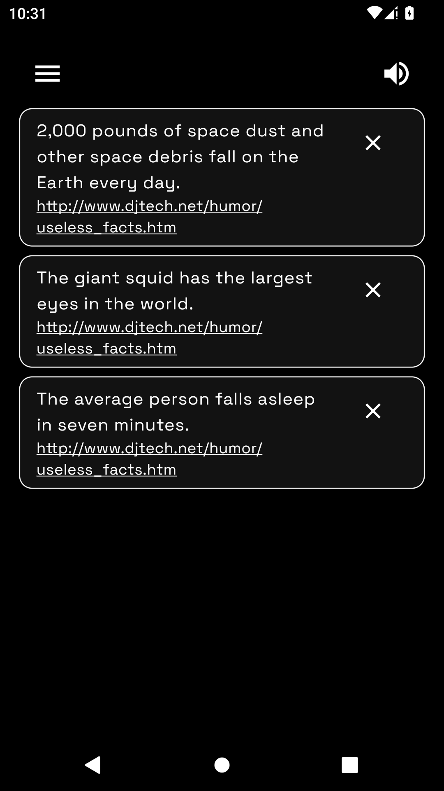

    

# Uselessfacts

Uselessfacts is a mobile application developed using Flutter with Riverpod and Dio. It leverages a [free API](https://uselessfacts.jsph.pl/) to fetch random useless facts.

The app features a black-and-white color scheme that creates a reflective atmosphere, complemented by smooth animations and soothing background music. In the future, there are plans to develop a custom backend in Dart, transforming this project into a full-stack application and adding more intriguing facts on various topics that inspire contemplation about life.

## Screenshots

    
Click to view screenshots

    

        
        
        
    

## Features

- **Random Facts**: Get random useless facts.
- **Favorites**: Save interesting facts to your favorites.
- **Offline Access**: Access your favorite facts even without internet!
- **Background Music**: Enjoy a pleasant ambiance with great music.

## Known Issues

In the web version on Chrome, music does not play automatically. You may need to turn the music off and then back on in the app for it to work.

## License

The code for this application is licensed under the [MIT License](LICENSE). Feel free to use, modify, and distribute it.

## Credits

The music used in the application is detailed in the [MUSIC.md](MUSIC.md) file.

Special thanks to [Joseph Paul](https://github.com/jsphpl) for providing the [API](https://uselessfacts.jsph.pl/) that powers this app!